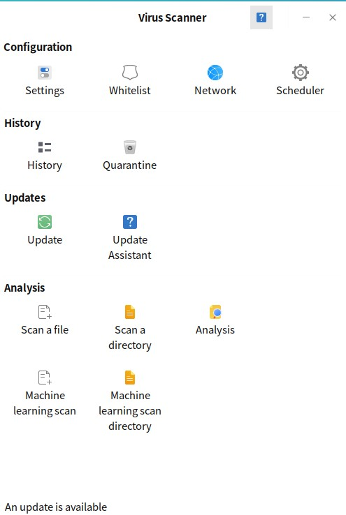
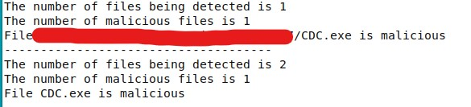

# IS217: Computer Virus Project
This is a malware detection program based on clamav, using RandomForest as machine learning model for detecting. Despite of the fact that it can achieve wonderful results on training dataset, it still performs poorly on real-world executable files.

#### Front End
*YN, LCY, CZX*

I have add two buttons for using our machine learning method to detect file and directory.

The front GUI now looks like as the follows.

For now, we only print the result in the commandline which will be optimized recently.

#### Back End
*TZX, CZX*

We add a machine learning algorithm for detection.